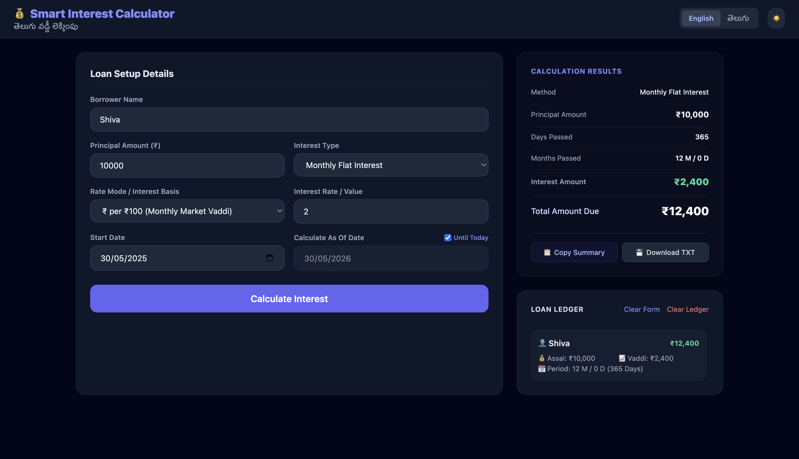
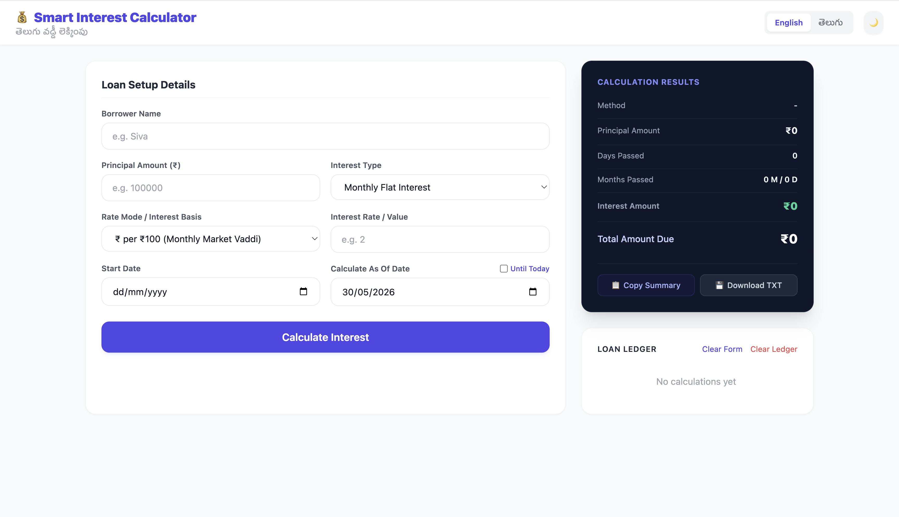
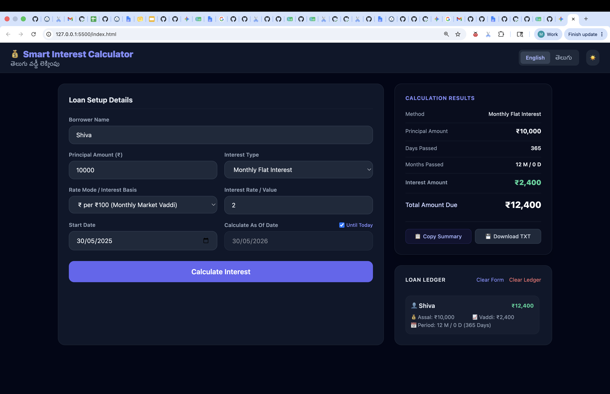

# Smart Interest Calculator 💰
### తెలుగు వడ్డీ లెక్కింపు

A dual-language (English & Telugu) financial calculator designed to help users calculate interest using both traditional local Vaddi systems and modern banking interest methods.

🌐 **Live Demo:** [Add Vercel Link Here]

---

## 🚀 Features
- **Comprehensive Interest Dynamics:** Monthly Flat Interest, Simple Interest, Compound Interest, and EMI (Equated Monthly Installment) Calculators.
- **Dual-Language Interface:** Seamless, instant toggle between English and Telugu language support.
- **Flexible Basis System:** Local Market Vaddi mode (₹ per ₹100) and Percentage-based interest mode (%).
- **Smart Date Engines:** Auto date duration calculation with a one-click "Until Today" quick calculation toggle.
- **Persistent Storage:** Built-in Loan Ledger to store and manage your calculations across sessions.
- **Data Export Utilities:** Copy calculation summaries instantly to your clipboard or use the TXT file export.
- **Responsive Layout:** Clean, fully responsive desktop and mobile interface featuring an immersive Dark Mode theme.

---

## 📊 Supported Calculations
- **Monthly Flat Interest (Vaddi)**
- **Simple Interest**
- **Compound Interest**
- **EMI Calculation**
- **Percentage (%) Based Interest**
- **Local Market Rate (₹ per ₹100) Based Interest**

---

## 🗂️ Loan Ledger
Store your loan calculation history safely and directly in your browser using `localStorage`. Your previously calculated loan records remain accessible, organized, and available even after completely restarting or refreshing the browser page.

---

## 📸 Screenshots

### English Interface


### Light Mode Interface


### Telugu Interface


---

## 🛠️ Tech Stack
- **Frontend:** HTML5, CSS3
- **Styling Utility:** Tailwind CSS
- **Core Engine:** Vanilla JavaScript (ES6+)
- **Data Storage:** Browser `localStorage`

---

## 📂 Project Structure
```text
Smart-Interest-Calculator/
├── index.html
├── about.html
├── privacy.html
├── README.md
├── css/
│   └── style.css
├── js/
│   ├── app.js
│   ├── calculator.js
│   ├── export.js
│   ├── storage.js
│   └── translations.js
└── assets/
    └── screenshots/
        ├── english-view.png
        ├── light_mode.png
        └── telugu-view.png